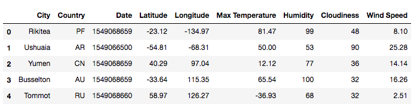
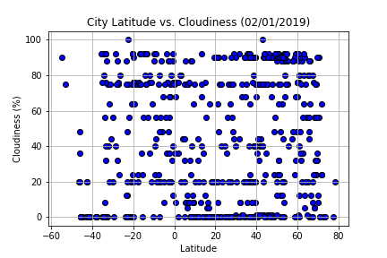

# What's the Weather Like?

## Background

"What's the weather like as we approach the equator?" Create a Python script to visualize the weather of 500+ cities across the world of varying distance from the equator using the [CityPy Python Library](https://pypi.python.org/pypi/citipy), and the [OpenWeatherMap API](https://openweathermap.org/api).

## Objectives

#### Convert Raw Data to DataFrame

Build a series of Scatter Plots to showcase the following relationships:

#### Temperature (F) vs. Latitude

#### Humidity (%) vs. Latitude

#### Cloudiness (%) vs. Latitude

#### Wind Speed (mph) vs. Latitude

The final notebook must:

* Randomly select at least 500 unique (non-repeat) cities based on latitude and longitude
* Perform a weather check on each of the cities using a series of successive API calls
* Include a print log of each city as it's being processed with the city number and city name
* Save both a CSV of all data retrieved and PNG images for each scatter plot

## Considerations

* The city data is generated based on random coordinates; as such, the outputs will not be an exact match each time the code is run
* Next, spend the requisite time necessary to study the OpenWeatherMap API. Based on your initial study, you should be able to answer basic questions about the API: Where do you request the API key? Which Weather API in particular will you need? What URL endpoints does it expect? What JSON structure does it respond with? Before a line of code is written, you should be aiming to have a crystal clear understanding of your intended outcome
* In building the script, pay attention to the cities that are used in the query pool. Are you getting coverage of the full gamut of latitudes and longitudes? Or are you simply choosing 500 cities concentrated in one region of the world? Simply rattling 500 cities based on your human selection would create a biased dataset. Be thinking of how this should be countered. (Hint: Consider the full range of latitudes).

## Observable Trends

* After collecting weather data from 559 random and diverse cities around the world using the OpenWeatherMap API, which was collected on February 1, 2019, the data illustrated maximum temperature (in Fahrenheit), humidity (%), cloudiness (%) and wind speed (in mph) with the corresponding city, and with respect to the geo-coordinate, Latitude. Expectedly, temperatures are higher closer to the Equator (at 0° Latitude) and are much lower in the Northern Hemishpere, at this time of year in February. It is also of worth to note that temperatures peak at around -20° to -30° Latitude, and drop slightly further into the Southern Hemisphere (at -40° Latitude and below), near the South Pole. This data on temperature is the result of seasons and the tilt of the Earth's axis compared to the plane of its revolution around the Sun. Throughout the year the northern and southern hemispheres are alternately turned either toward or away from the sun depending on Earth's position in its orbit. The hemisphere turned toward the sun receives more sunlight and is in summer, while the other hemisphere receives less sun and is in winter.

* There seems to be little to no correlation between humidity and Latitude as well as with cloudiness and Latitude. The scatter plot visualizations display a considerable amount of heterogeneity even at similar Latitudes. Basically, they're all over the map. However, a small grouping of cities exhibited abnormally low humity levels (at 0% humidity) in the Northern Hemisphere at around 60° to 75° Latitude.

* Finally, wind speeds increase in the upper and lower halves on the hemisphere, especially in the north (around 60° to 70° Latitude), and do not go above 25mph within 30° of the Equator.